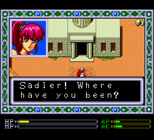
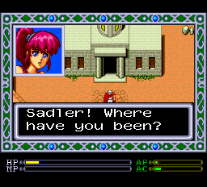

# PC Engine System Card Font Fix

The PC Engine System card contains both 12x12 and 16x16 fonts for the SJIS characters set; this is 
generally considered to be "kanji support", but there are also standard (and some non-standard !)
characters included.

As many people have noticed, however, the font design for the Western characters leaves much to be desired.
Lack of descenders, weird mismatched character types, and misaligned base lines are just some of the issues.

So I finally took it upon myself to ameliorate these problems.
(I'm not claiming that they're all solved... but anyway, they're better than before).

I have included screenshots of an early screen on the American release of Exile (before and after); this should
give a clear indication of whether this patch is for you.  Personally, I found any game using the built-in 12x12
and 16x16 fonts for English text to be painful after only a short period.

Before:

After:

I am including the patch as an IPS file for "Version 3.0" Super System Cards; this IPS expects a ROM with
header, and should work equally well on both Japanese and American versions, as the font information is stored
at the same loacations in both.

